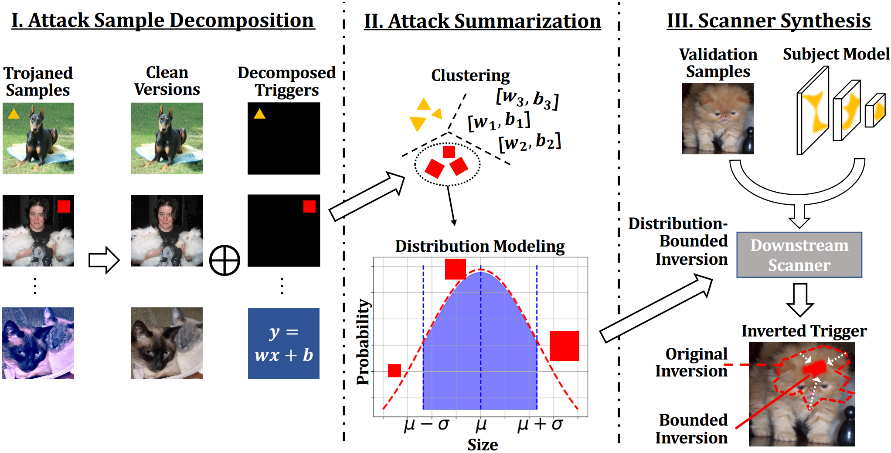

<div align="center">
    
</div>

# BEAGLE: Forensics of Deep Learning Backdoor Attack for Better Defense


Table of Contents
=================
- [Table of Contents](#table-of-contents)
  - [Overview](#overview)
  - [Highlights](#highlights)
  - [Code Architecutre](#code-architecture)
  - [Environments](#environments)
  - [Requirement](#requirement)
  - [Backdoor Removal (CIFAR-10)](#backdoor-removal-cifar-10)
    - [Usage](#usage)
    - [Step 1: Attack Decomposition](#step-1-attack-decomposition)
    - [Step 2: Adversarial Training](#step-2-adversarial-training)
  - [Backdoor Scanning (TrojAI Round-3)](#backdoor-scanning-trojai-round-3)
    - [Usage](#usage)
    - [Step 1: Attack Decomposition](#step-1-attack-decomposition-1)
    - [Step 2: Attack Summarization](#step-2-attack-summarization)
    - [Step 3: Backdoor Scanning](#step-3-backdoor-scanning)
  - [Citation](#citation)
  - [Acknowledgement](#acknowledgement)

## Overview
- This is the official implementation for NDSS 2023 paper "[BEAGLE: Forensics of Deep Learning Backdoor Attack for Better Defense](https://www.ndss-symposium.org/ndss-paper/beagle-forensics-of-deep-learning-backdoor-attack-for-better-defense/)".
- [[arXiv](https://arxiv.org/abs/2301.06241)\] | \[[video](https://www.youtube.com/watch?v=XtFB0FUvQoY&list=PLfUWWM-POgQuKDB34EU-K47SBafs-4fHt&index=4)\] | \[[slides](https://www.cs.purdue.edu/homes/cheng535/static/slides/beagle_slides.pdf)\]




## Highlights
- BEAGLE can act as an <span style="color: red;">Adaptive Defense</span> against various backdoor attacks, requiring only a few examples of the backdoor.
- BEAGLE serves as a <span style="color: red;">Backdoor Scanning</span> tool. With just a few poisoned models and samples of a specific backdoor, it synthesizes a scanner specifically tailored to detect that backdoor.
- BEAGLE also operates as a <span style="color: red;">Backdoor Removal</span> tool. Using a few poisoned samples from a single model, it synthesizes the trigger injection function and employs adversarial training to harden the model against backdoor effects.


## Code Architecture
    .
    ├── checkpoints                 # Model path of the pre-trained StyleGAN
    ├── cifar10                     # Forensics on CIFAR-10 dataset
    │   ├── backdoors               # Backdoor functions
    │   ├── ckpt                    # Pre-trained attacked models
    │   ├── data                    # Trigger patterns and dataset
    │   ├── models                  # Model architectures
    │   ├── backdoor_removal.py     # Backdoor removal using BEAGLE
    │   ├── decomposition.py        # Attack decomposition
    │   ├── invert_func.py          # Decomposition functions
    │   ├── stylegan.py             # Load the StyleGAN model
    │   ├── stylegan2ada_generator_with_styles_noises.py  # StyleGAN model functions
    │   └── utils.py                # Utility functions 
    ├── trojai_round3               # Forensics on TrojAI round-3 dataset
    │   ├── abs_beagle_filter.py    # Sythesized scanner against filter backdoors
    │   ├── abs_beagle_polygon.py   # Sythesized scanner against polygon backdoors
    │   ├── gen_filter.py           # Attack decomposition for filter backdoors
    │   ├── gen_polygon.py          # Attack decomposition for polygon backdoors
    │   ├── invert_func.py          # Decomposition functions
    │   ├── stylegan.py             # Load the StyleGAN model
    │   ├── stylegan2ada_generator_with_styles_noises.py  # StyleGAN model functions
    │   └── synthesis_scanner.py    # Scanner synthesis functions

## Environments
```bash
# Create python environment (optional)
conda env create -f environment.yml
source activate beagle
```

## Requirement
Please download the pre-trained StyleGAN model from the following link:
[Download Pre-trained Model](https://drive.google.com/file/d/1qoOcM77h-MZLBzHzFzB3nGPF2AE4Jndm/view?usp=sharing)

After downlowding, place it in the `./checkpoints directory`.

This model is fine-tuned from [StyleGAN2-ADA](https://github.com/NVlabs/stylegan2-ada) by NVlabs. Special acknowledgment!


## Backdoor Removal (CIFAR-10)
- BEAGLE serves as a tool for backdoor removal, given a few poisoned samples.
- With just a few poisoned samples (e.g., 10), BEAGLE extracts the injected trigger from these samples, and employs adversarial training to harden the model using the extracted trigger.
- Our codes are based on the CIFAR-10 dataset and the ResNet18 model architecture.
- We use BadNets, Refool and WaNet as three example backdoor attacks.

### Usage
- Go to the `./cifar10` directory.
```bash
cd ./cifar10
```

### Step 1: Attack Decomposition
- Decompose the attack and extract triggers from the poisoned samples.
```bash
# Decomposition of BadNets attack (bimonial mask)
python decomposition.py --gpu 0 --dataset cifar10 --network resnet18 --attack badnet --target 0 --n_clean 100 --n_poison 10 --func mask --func_option binomial --save_folder forensics --verbose 1 --epochs 1000 --seed 1024
```
```bash
# Decomposition of Refool attack (uniform mask)
python decomposition.py --gpu 1 --attack refool --func mask --func_option uniform
```
```bash
# Decomposition of WaNet attack (complex transformation)
python decomposition.py --gpu 2 --attack wanet --func transform --func_option complex
```

| Arguments | Default Value | Description |
|----------------|---------------|-------------|
| gpu | 0 | Available GPU ID. |
| dataset | "cifar10" | Utilized dataset. |
| network | "resnet18" | Utilized model architecture. |
| attack | "dfst" | Backdoor attack type. |
| target | 0 | Attack target label. |
| n_clean | 100 | Number of available clean samples. |
| n_poison | 10 | Number of available poisoned samples. |
| func | "mask" | Decomposition function. |
| func_option | "binomial" | Decomposition functioning option. |
| save_folder | "forensics" | Result folder. |
| verbose | 1 | Print control. |
| epochs | 200 | Total number of processing epochs. |
| seed | 1024 | Random seed for reproducibility. |

- Outputs are saved by default in the `./forensics` folder.
- For each attack and its corresponding decomposition function, a folder is created (e.g., `./forensics/mask_binomial_badnet_cifar10_resnet18`).
This folder contains a visualization figure and the trigger parameter `param`.


### Step 2: Adversarial Training
- Use adversarial training to counteract the backdoor, using the decomposed trigger.
- Specifically, in each batch, we apply the trigger to half of the samples as an adversarial augmentation to mitigate the backdoor effect.
```bash
# Backdoor removal using adversarial fine-tuning
python backdoor_removal.py --gpu 0 --attack badnet --ratio 0.01 --batch_size 128 --lr 0.01 --epochs 10
```

| New Arguments | Default Value | Description |
|----------------|---------------|-------------|
| ratio | 0.01 | Proportion of samples used from the training set. |
| batch_size | 128 | Size of each batch. |
| lr | 0.01 | Learning rate for fine-tuning |
| epochs | 10 | Number of fine-tuning epochs |

- Outputs are printed. For example, standard fine-tuning maintains the Attack Success Rate (ASR) of BadNets at 100%, whereas BEAGLE reduces it to 2.86%.

- More backdoor attacks can be found at [BackdoorVault](https://github.com/Gwinhen/BackdoorVault) and [OrthogLinearBackdoor](https://github.com/KaiyuanZh/OrthogLinearBackdoor).


## Backdoor Scanning (TrojAI Round-3)
- BEAGLE serves as a backdoor scanning tool for backdoor detection across a large number of models.
- Using a few poisoned models and samples from a unique backdoor type, we extract the trigger properties to develop a synthesized scanner tailored for that backdoor.
- Our code is based on the TrojAI Round-3 dataset, which includes over 1,000 models. We used 40 of these models to design our scanners.
- The TrojAI dataset is available for download at [TrojAI-Round-3](https://pages.nist.gov/trojai/docs/image-classification-dec2020.html#image-classification-dec2020).

### Usage
- Go to the `./trojai_round3` directory.
```bash
cd ./trojai_round3
```

### Step 1: Attack Decomposition
- Decompose the attack and extract triggers from the poisoned samples.
```bash
# Decomposition of Polygon backdoors
python gen_polygon.py --gpu 0 --dataset_dir "[trojai_dataset_dir]" --epochs 1000 --save_folder "forensics/trojai_polygon/" --verbose 1 --seed 1024
```
```bash
# Decomposition of Instagram filter backdoors
python gen_filter.py --gpu 1 --dataset_dir "[trojai_dataset_dir]" --epochs 1000 --save_folder "forensics/trojai_filter/" --verbose 1 --seed 1024
```

| Arguments | Default Value | Description |
|----------------|---------------|-------------|
| dataset_dir | - | Directory for the TrojAI dataset. |
| epochs | 1000 | Total number of decomposition epochs. |
| save_folder | - | Directory to save outputs. |

- Outputs are stored in the `save_folder`.
- To modify the models for attack decomposition, edit Line 357 in `gen_polygon.py` and Line 312 in `gen_filter.py`.
- A folder is created for each model (e.g., `./forensics/polygon/id-00000003`). This folder contains a visualization figure and the trigger parameter (e.g., `mask_pattern`).


### Step 2: Attack Summarization
- Attack properties are summarized in `synthesis_scanner.py`.


### Step 3: Backdoor Scanning
- We enhance the ABS scanner with the summarized attack propoerties.
```bash
# Scanning for Polygon backdoors
python abs_beagle_polygon.py --gpu 0 --dataset_dir "[trojai_dataset_dir]" --scatch_dirpath "scratch"
```
```bash
# Scanning for Instagram filter backdoors
python abs_beagle_filter.py --gpu 1 --dataset_dir "[trojai_dataset_dir]" --scatch_dirpath "scratch"
```

- Results will be output in `result.txt`, with each line recording the backdoor type, model ID, trojan probability, and additional trigger inversion results.


## Citation
Please cite our paper if you find it useful for your research.😀

```bibtex
@article{cheng2023beagle,
  title={BEAGLE: Forensics of Deep Learning Backdoor Attack for Better Defense},
  author={Cheng, Siyuan and Tao, Guanhong and Liu, Yingqi and An, Shengwei and Xu, Xiangzhe and Feng, Shiwei and Shen, Guangyu and Zhang, Kaiyuan and Xu, Qiuling and Ma, Shiqing and Zhang, Xiangyu},
  journal={arXiv preprint arXiv:2301.06241},
  year={2023}
}
```

## Acknowledgement
- [(NVlabs) StyleGAN2-ADA](https://github.com/NVlabs/stylegan2-ada)
- [BackdoorVault](https://github.com/Gwinhen/BackdoorVault)
- [OrthogLinearBackdoor](https://github.com/KaiyuanZh/OrthogLinearBackdoor)
